# E-commerce Distribuído com Microsserviços

Sistema de e-commerce desenvolvido como projeto prático da disciplina de **Sistemas Distribuídos**. A aplicação simula um fluxo completo de compra usando microsserviços, comunicação síncrona com gRPC, comunicação assíncrona com RabbitMQ, Pub/Sub, filas dedicadas e Service Discovery com Eureka.

## Sumário

- [Visão geral](#visão-geral)
- [Arquitetura](#arquitetura)
- [Stack tecnológica](#stack-tecnológica)
- [Serviços e portas](#serviços-e-portas)
- [Como executar](#como-executar)
- [Endpoints REST](#endpoints-rest)
- [Fluxo de teste](#fluxo-de-teste)
- [Descrição Técnica](#descrição-técnica)
- [Análise Conceitual](#análise-conceitual)
- [Reflexão do Grupo](#reflexão-do-grupo)
- [Evidências](#evidências)
- [Estrutura do projeto](#estrutura-do-projeto)

## Visão geral

O projeto é composto por seis microsserviços backend, um servidor de descoberta, um frontend React e infraestrutura local com PostgreSQL, RabbitMQ e pgAdmin.

Fluxo principal:

1. O usuário visualiza produtos no frontend.
2. O frontend adiciona itens ao carrinho via Carrinho Service.
3. O Carrinho Service cria o pedido chamando o Pedido Service via gRPC.
4. O Pedido Service persiste o pedido e publica o evento `pedido.criado` em uma fila dedicada.
5. O Carrinho Service solicita o pagamento automaticamente via REST usando o nome lógico `pagamento-service`.
6. O Pagamento Service publica o evento `pagamento.aprovado` em uma Fanout Exchange.
7. Pedido, Estoque e Notificação consomem o evento de pagamento de forma independente.

## Arquitetura

```text
                             +----------------------+
                             | Eureka Server :8761  |
                             | Service Discovery    |
                             +----------+-----------+
                                        |
                                        | registro/descoberta
                                        |
+------------------+          +---------v--------+        gRPC        +----------------------+
| Frontend :3000   |  REST    | Carrinho :8083   | ----------------> | Pedido :8082 / :9090 |
| React + Nginx    | -------> | REST + gRPC      |                   | REST + gRPC + AMQP   |
+------------------+          +---------+--------+                   +----------+-----------+
            |                           |                                      |
            | REST                      | REST via Eureka                      | Direct Exchange
            v                           v                                      | pedido.exchange
+------------------+          +------------------+                            v
| Produto :8081    |          | Pagamento :8084  |                   +----------------------+
| Catálogo REST    |          | AMQP Publisher   |                   | Notificação :8086    |
+------------------+          +---------+--------+                   | Consome fila direta  |
                                      |                              +----------------------+
                                      |
                                      | Fanout Exchange pagamento.exchange
                                      |
                         +------------+-------------+
                         |            |             |
                         v            v             v
                +-------------+ +-------------+ +-------------+
                | Pedido      | | Estoque     | | Notificação |
                | Consumer    | | Consumer    | | Consumer    |
                +-------------+ +-------------+ +-------------+
```

## Stack tecnológica

| Tecnologia | Uso |
| --- | --- |
| Java 21 | Linguagem dos microsserviços |
| Spring Boot 3.2 | APIs REST, serviços e persistência |
| Spring Cloud Netflix Eureka | Service Discovery |
| gRPC + Protocol Buffers | RPC entre Carrinho e Pedido |
| RabbitMQ | Filas, eventos e Pub/Sub |
| PostgreSQL 15 | Persistência dos serviços com banco separado |
| React + TypeScript | Frontend |
| Docker Compose | Build e execução local da solução |
| pgAdmin | Administração visual do PostgreSQL |

## Serviços e portas

| Serviço | Porta | Responsabilidade | Banco |
| --- | ---: | --- | --- |
| Frontend | `3000` | Interface web do e-commerce | - |
| Eureka Server | `8761` | Registro e descoberta de serviços | - |
| Produto Service | `8081` | Catálogo e CRUD de produtos | `produto_db` |
| Pedido Service | `8082` REST / `9090` gRPC | Criação e consulta de pedidos | `pedido_db` |
| Carrinho Service | `8083` | Carrinho e checkout | `carrinho_db` |
| Pagamento Service | `8084` | Processamento simulado de pagamento | - |
| Estoque Service | `8085` | Consumo de pagamento aprovado | `estoque_db` |
| Notificação Service | `8086` | Consumo de eventos e alertas simulados | - |
| PostgreSQL | `5432` | Banco de dados | - |
| RabbitMQ Management | `15672` | Console de filas e exchanges | - |
| pgAdmin | `5050` | Console PostgreSQL | - |

## Como executar

### Pré-requisitos

- Docker
- Docker Compose

### Subir a aplicação

Na raiz do projeto:

```bash
docker compose up -d --build
```

Esse comando constrói e inicia todos os serviços:

- PostgreSQL
- pgAdmin
- RabbitMQ
- Eureka Server
- Produto Service
- Pedido Service
- Carrinho Service
- Pagamento Service
- Estoque Service
- Notificação Service
- Frontend

### Verificar os containers

```bash
docker compose ps
```

### Acompanhar logs

Todos os serviços:

```bash
docker compose logs -f
```

Um serviço específico:

```bash
docker compose logs -f carrinho-service
```

Eventos assíncronos:

```bash
docker compose logs -f pedido-service pagamento-service estoque-service notificacao-service
```

### Parar a aplicação

```bash
docker compose down
```

Para remover também os dados persistidos no volume do PostgreSQL:

```bash
docker compose down -v
```

## Acessos úteis

| Recurso | URL | Credenciais |
| --- | --- | --- |
| Frontend | http://localhost:3000 | - |
| Eureka Dashboard | http://localhost:8761 | - |
| RabbitMQ Management | http://localhost:15672 | `guest` / `guest` |
| pgAdmin | http://localhost:5050 | `admin@admin.com` / `admin` |
| PostgreSQL | `localhost:5432` | `root` / `rootpassword` |

O `init.sql` cria os bancos `produto_db`, `carrinho_db`, `pedido_db` e `estoque_db`. O Produto Service também possui um `DataSeeder` que cadastra produtos iniciais quando o banco está vazio.

## Endpoints REST

### Produto Service

Base URL: `http://localhost:8081`

| Método | Endpoint | Descrição |
| --- | --- | --- |
| `GET` | `/api/produtos` | Lista produtos |
| `GET` | `/api/produtos/{id}` | Busca produto por ID |
| `POST` | `/api/produtos` | Cria produto |
| `DELETE` | `/api/produtos/{id}` | Remove produto |

Exemplo:

```http
POST http://localhost:8081/api/produtos
Content-Type: application/json
```

```json
{
  "nome": "Notebook",
  "descricao": "Notebook Dell",
  "preco": 3500.0,
  "estoque": 10
}
```

### Carrinho Service

Base URL: `http://localhost:8083`

| Método | Endpoint | Descrição |
| --- | --- | --- |
| `GET` | `/api/carrinho/{usuarioId}` | Busca ou cria o carrinho do usuário |
| `POST` | `/api/carrinho/{usuarioId}/adicionar` | Adiciona item ao carrinho |
| `POST` | `/api/carrinho/{usuarioId}/checkout` | Cria pedido via gRPC e solicita pagamento via REST |

Exemplo:

```http
POST http://localhost:8083/api/carrinho/1/adicionar
Content-Type: application/json
```

```json
{
  "produtoId": 1,
  "quantidade": 1,
  "precoUnitario": 7299.0
}
```

### Pedido Service

Base URL: `http://localhost:8082`

| Método | Endpoint | Descrição |
| --- | --- | --- |
| `GET` | `/api/pedidos` | Lista pedidos |
| `GET` | `/api/pedidos/{id}` | Busca pedido por ID |
| `GET` | `/api/pedidos/usuario/{usuarioId}` | Lista pedidos por usuário |

O Pedido Service também expõe um servidor gRPC na porta `9090`, definido em `grpc-contracts/src/main/proto/pedido.proto`.

### Pagamento Service

Base URL: `http://localhost:8084`

| Método | Endpoint | Descrição |
| --- | --- | --- |
| `POST` | `/api/pagamento/processar?pedidoId={pedidoId}&valor={valor}` | Processa pagamento simulado e publica evento no RabbitMQ |

Exemplo:

```http
POST http://localhost:8084/api/pagamento/processar?pedidoId=1&valor=7299.0
```

### Serviços sem endpoint REST público

| Serviço | Como funciona |
| --- | --- |
| Estoque Service | Consome eventos de pagamento aprovado na fila `estoque.queue` |
| Notificação Service | Consome `pedido.criado.queue` e `notificacao.queue` |

## Fluxo de teste

### Pela interface web

1. Acesse http://localhost:3000.
2. Adicione um produto ao carrinho.
3. Finalize a compra.
4. Consulte os logs dos serviços para acompanhar gRPC, REST e RabbitMQ.

```bash
docker compose logs -f carrinho-service pedido-service pagamento-service estoque-service notificacao-service
```

### Pela API

1. Liste os produtos:

```bash
curl http://localhost:8081/api/produtos
```

2. Adicione um produto ao carrinho:

```bash
curl -X POST http://localhost:8083/api/carrinho/1/adicionar \
  -H "Content-Type: application/json" \
  -d '{"produtoId":1,"quantidade":1,"precoUnitario":7299.0}'
```

3. Consulte o carrinho:

```bash
curl http://localhost:8083/api/carrinho/1
```

4. Faça checkout:

```bash
curl -X POST http://localhost:8083/api/carrinho/1/checkout
```

5. Consulte os pedidos:

```bash
curl http://localhost:8082/api/pedidos
```

6. Verifique as filas e exchanges no RabbitMQ Management:

```text
http://localhost:15672
```

## Descrição Técnica

Esta seção atende aos itens obrigatórios de comunicação distribuída: invocação remota, gRPC, mensageria, eventos, filas, Pub/Sub e serviço de nomes.

### Invocação Remota (RPC)

RPC (Remote Procedure Call) permite que um serviço invoque uma operação em outro serviço remoto com uma interface parecida com uma chamada local. No projeto, isso ocorre no fluxo de checkout:

1. O Carrinho Service recebe a requisição REST de checkout.
2. O Carrinho Service monta uma mensagem `CriarPedidoRequest`.
3. O Carrinho Service chama `pedidoStub.criarPedido(request)`.
4. O Pedido Service processa a chamada no método `criarPedido`.
5. O Pedido Service retorna `CriarPedidoResponse` com `pedidoId`, `status` e `mensagem`.

### gRPC para comunicação síncrona

O Carrinho Service usa gRPC para criar pedidos no Pedido Service:

- Contrato: `grpc-contracts/src/main/proto/pedido.proto`
- Cliente: `carrinho-service/src/main/java/com/ecommerce/carrinho/service/CarrinhoService.java`
- Servidor: `pedido-service/src/main/java/com/ecommerce/pedido/service/PedidoGrpcService.java`
- Endereço via discovery: `discovery:///pedido-service`

Essa comunicação é síncrona porque o Carrinho Service aguarda a resposta do Pedido Service antes de esvaziar o carrinho e solicitar o pagamento. O contrato gRPC é definido em Protocol Buffers, funcionando como IDL (Interface Definition Language) entre os serviços.

### Mensageria e eventos com RabbitMQ

O RabbitMQ é usado para desacoplar serviços e permitir processamento assíncrono. O projeto usa dois padrões:

- Fila dedicada com Direct Exchange para processamento ponto-a-ponto.
- Publish/Subscribe com Fanout Exchange para distribuir eventos para múltiplos consumidores.

### Fila dedicada com Direct Exchange

Quando um pedido é criado, o Pedido Service publica um evento ponto-a-ponto para o Notificação Service.

| Item | Valor |
| --- | --- |
| Exchange | `pedido.exchange` |
| Tipo | `DirectExchange` |
| Routing key | `pedido.criado` |
| Fila | `pedido.criado.queue` |
| Produtor | Pedido Service |
| Consumidor | Notificação Service |

Esse padrão representa uma fila de processamento assíncrono: o Pedido Service não precisa esperar o Notificação Service executar sua lógica para concluir a criação do pedido.

### Pub/Sub com Fanout Exchange

Quando um pagamento é aprovado, o Pagamento Service publica um evento para todos os assinantes.

| Item | Valor |
| --- | --- |
| Exchange | `pagamento.exchange` |
| Tipo | `FanoutExchange` |
| Filas | `estoque.queue`, `notificacao.queue`, `pedido.pagamento.queue` |
| Publicador | Pagamento Service |
| Assinantes | Estoque Service, Notificação Service, Pedido Service |

Nesse caso, cada serviço tem sua própria fila ligada à mesma exchange. Assim, o mesmo evento de pagamento é entregue de forma independente para Pedido, Estoque e Notificação.

### Serviço de nomes com Eureka

O Eureka Server atua como serviço de nomes e registro de serviços. Cada microsserviço registra seu nome lógico no Eureka, permitindo que outros serviços o encontrem sem conhecer IP ou porta fixa.

| Elemento | Implementação |
| --- | --- |
| Servidor de nomes | `eureka-server` na porta `8761` |
| Clientes registrados | Produto, Carrinho, Pedido, Pagamento, Estoque e Notificação |
| REST com discovery | Carrinho chama `http://pagamento-service/...` |
| gRPC com discovery | Carrinho usa `discovery:///pedido-service` |
| Configuração | `application.yml` de cada serviço e variáveis no `docker-compose.yml` |

## Análise Conceitual

### Descrição dos serviços

| Serviço | Descrição |
| --- | --- |
| Produto Service | Gerencia o catálogo de produtos e persiste dados em `produto_db`. |
| Carrinho Service | Gerencia o carrinho do usuário, calcula total e orquestra o checkout. |
| Pedido Service | Recebe chamadas gRPC, cria pedidos, publica evento de pedido criado e atualiza status após pagamento. |
| Pagamento Service | Simula processamento financeiro e publica evento de pagamento aprovado. |
| Estoque Service | Consome evento de pagamento aprovado para representar baixa ou reserva de estoque. |
| Notificação Service | Consome eventos de pedido criado e pagamento aprovado para simular notificações. |
| Eureka Server | Centraliza registro e descoberta de microsserviços. |
| Frontend | Interface web para listar produtos, adicionar ao carrinho e finalizar compra. |

### Mapeamento entre código e teoria

| Conceito | Implementação no projeto |
| --- | --- |
| RPC | `CarrinhoService.java` chama `PedidoServiceGrpc.PedidoServiceBlockingStub`. |
| Stub do cliente | `pedidoStub` em `carrinho-service/src/main/java/com/ecommerce/carrinho/service/CarrinhoService.java`. |
| Skeleton/servidor | `PedidoGrpcService extends PedidoServiceImplBase` em `pedido-service/src/main/java/com/ecommerce/pedido/service/PedidoGrpcService.java`. |
| IDL | `grpc-contracts/src/main/proto/pedido.proto`. |
| Serialização | Protocol Buffers converte objetos em formato binário para transporte. |
| Comunicação síncrona | Checkout aguarda a resposta gRPC de criação do pedido. |
| Comunicação assíncrona | Eventos enviados pelo RabbitMQ para processamento posterior. |
| Fila ponto-a-ponto | `pedido.criado.queue` consumida pelo Notificação Service. |
| Publish/Subscribe | `pagamento.exchange` entrega o mesmo evento para múltiplas filas. |
| Serviço de nomes | Eureka registra e resolve nomes lógicos dos serviços. |
| Middleware | Spring Cloud, gRPC e RabbitMQ abstraem rede, descoberta, serialização e entrega de mensagens. |

### Transparências aplicadas

| Transparência | Como aparece no projeto |
| --- | --- |
| Acesso | A chamada `pedidoStub.criarPedido(request)` parece uma chamada local, mas executa lógica remota no Pedido Service. |
| Localização | O Carrinho Service usa `http://pagamento-service/...` e `discovery:///pedido-service`, sem depender de IP fixo. |
| Falha | A chamada REST para pagamento possui `try-catch`; se falhar, o pedido continua criado e o erro é registrado no log. |
| Concorrência | Pedido, Estoque e Notificação consomem o mesmo evento de pagamento em filas separadas, sem bloquear uns aos outros. |
| Migração | Com Docker Compose e Eureka, serviços podem mudar de endereço dentro da rede sem alteração no código consumidor. |
| Replicação | Não foi implementada explicitamente, mas Eureka e `@LoadBalanced RestTemplate` permitem evoluir para múltiplas instâncias. |

## Reflexão do Grupo

### Dificuldades encontradas

- Integrar gRPC com Service Discovery, especialmente a configuração `discovery:///pedido-service`.
- Garantir a ordem de inicialização entre PostgreSQL, RabbitMQ, Eureka e microsserviços.
- Diferenciar corretamente fila dedicada e Pub/Sub na implementação com RabbitMQ.
- Padronizar a serialização das mensagens entre serviços usando `Jackson2JsonMessageConverter`.
- Manter bancos separados por serviço e configurar as URLs corretamente no Docker Compose.

### Decisões arquiteturais

- Usar gRPC entre Carrinho e Pedido porque a criação de pedido é uma operação síncrona central do checkout.
- Usar REST entre Carrinho e Pagamento para demonstrar outro padrão de comunicação entre serviços com Service Discovery.
- Usar Direct Exchange para `pedido.criado`, pois a notificação de pedido criado tem um consumidor principal.
- Usar Fanout Exchange para `pagamento.aprovado`, pois o mesmo evento interessa a Pedido, Estoque e Notificação.
- Separar os bancos `produto_db`, `carrinho_db`, `pedido_db` e `estoque_db` para respeitar o isolamento de dados em microsserviços.
- Usar Docker Compose para tornar a execução reproduzível em ambiente local.

### Possíveis melhorias

- Adicionar API Gateway com Spring Cloud Gateway.
- Adicionar autenticação com Spring Security e JWT.
- Implementar Circuit Breaker com Resilience4j.
- Evoluir o fluxo para Saga Pattern com compensações.
- Adicionar observabilidade com Spring Actuator, Prometheus e Grafana.
- Criar testes de integração com Testcontainers.
- Adicionar dead-letter queues e políticas de retry no RabbitMQ.
- Separar configurações por perfil (`local`, `docker`, `test`).

## Evidências

Esta seção apresenta os prints capturados do sistema em execução e das comunicações entre serviços.

### Prints do sistema funcionando

#### Containers ativos no Docker

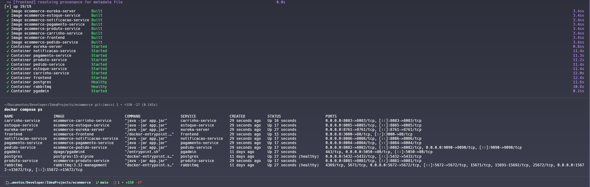

#### Frontend do e-commerce

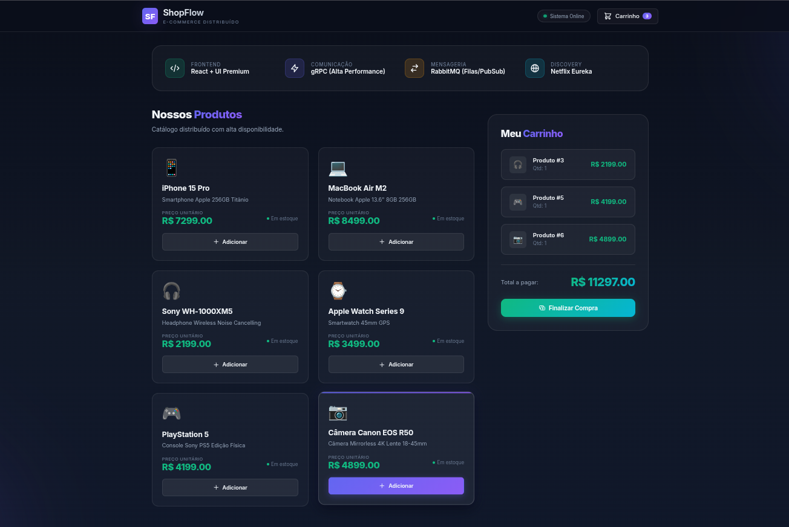

#### Eureka Dashboard com serviços registrados

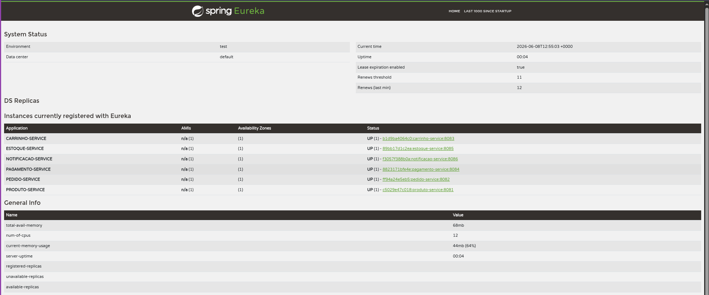

#### RabbitMQ Overview

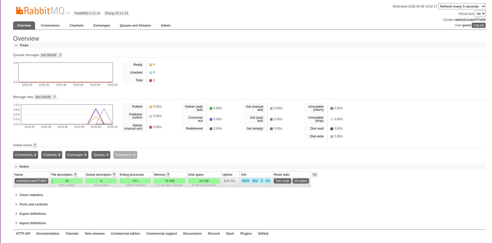

#### RabbitMQ Exchange de pedido

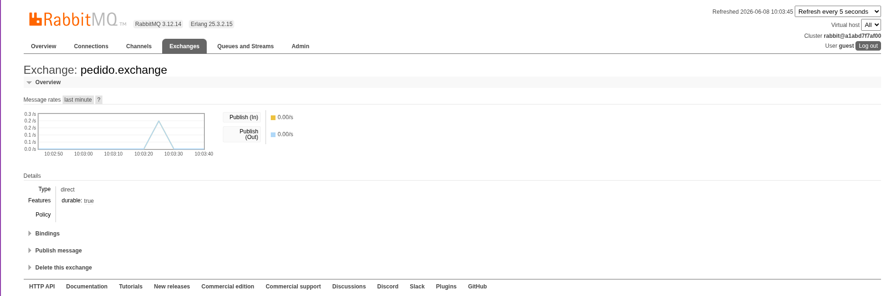

#### RabbitMQ Exchange de pagamento

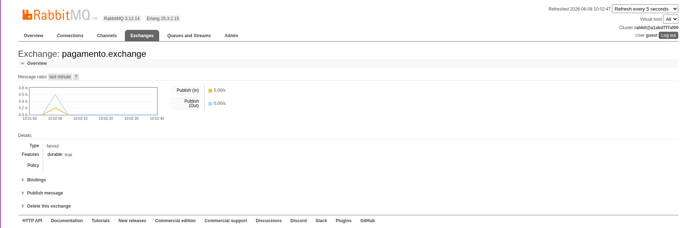

#### Bancos de dados no PostgreSQL

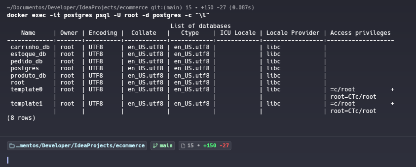

### Demonstração das comunicações

#### Produto Service - criação de produto

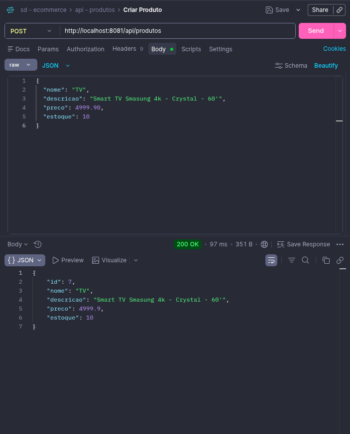

#### Produto Service - listagem de produtos

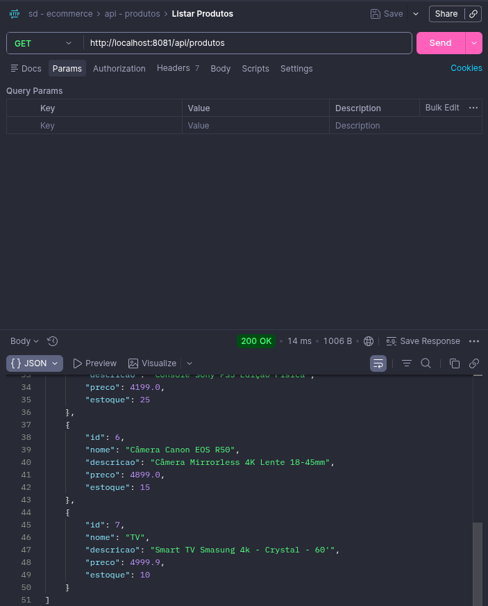

#### Carrinho Service - adicionar item

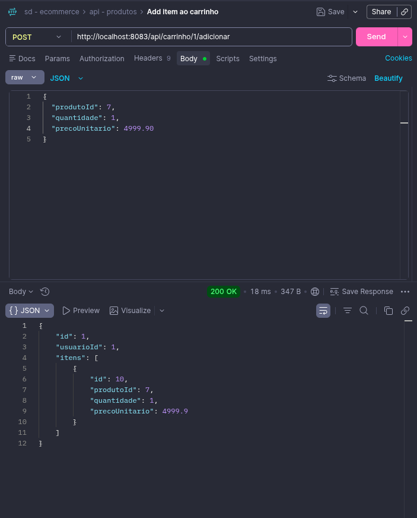

#### Carrinho Service - consultar carrinho

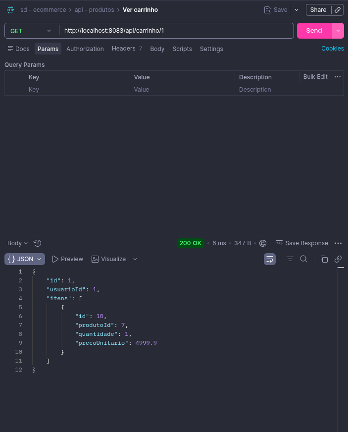

#### Carrinho Service - checkout

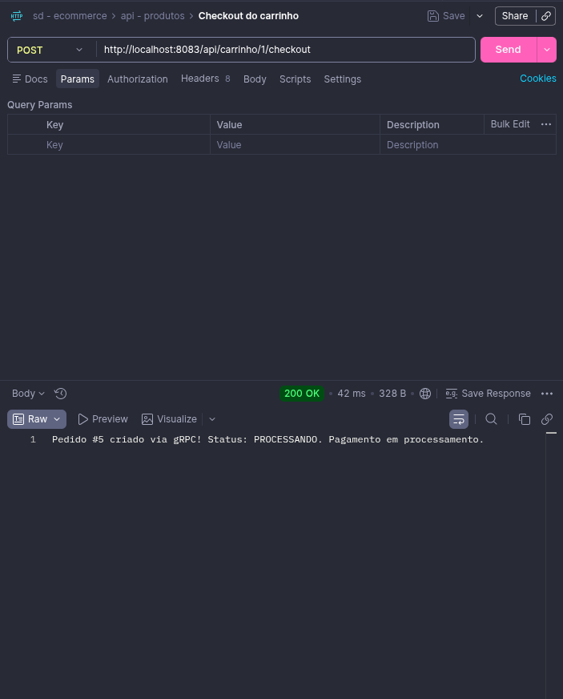

#### Pagamento Service - processamento de pagamento

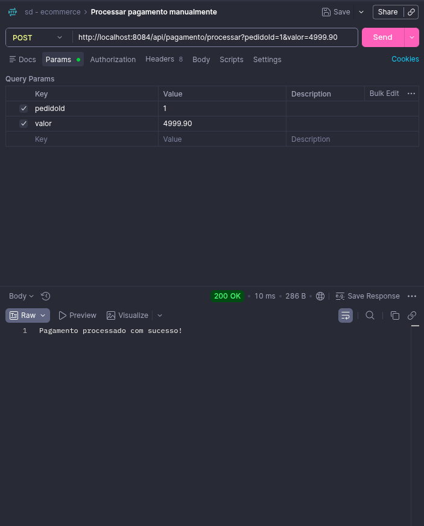

#### Logs da comunicação gRPC entre Carrinho e Pedido

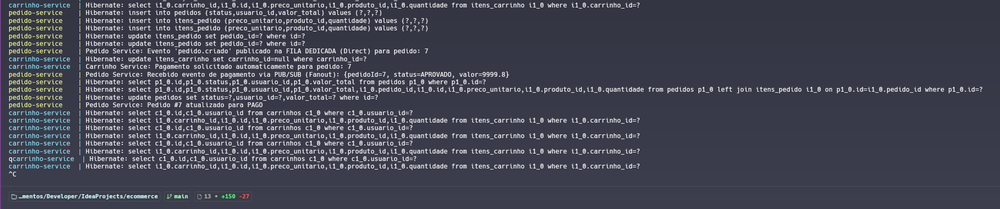

#### Logs dos eventos RabbitMQ entre Pedido, Pagamento e Estoque

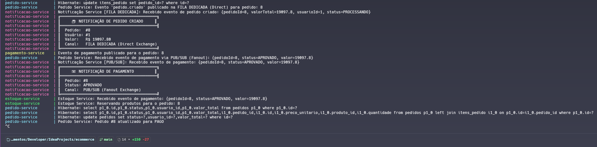

### Onde cada conceito foi aplicado

| Conceito | Serviços envolvidos | Arquivo principal | Evidência |
| --- | --- | --- | --- |
| gRPC/RPC | Carrinho -> Pedido | `CarrinhoService.java` / `PedidoGrpcService.java` | Checkout cria pedido por chamada remota. |
| Fila | Pedido -> Notificação | `RabbitConfig.java` / `NotificacaoConsumer.java` | Evento `pedido.criado` chega em `pedido.criado.queue`. |
| Pub/Sub | Pagamento -> Pedido, Estoque, Notificação | `PagamentoService.java` / consumers RabbitMQ | Evento de pagamento chega em três filas diferentes. |
| Service Discovery | Todos os microsserviços -> Eureka | `application.yml` / `docker-compose.yml` | Serviços aparecem no Eureka e usam nomes lógicos. |
| Banco por serviço | Produto, Carrinho, Pedido, Estoque | `init.sql` / `application.yml` | Bancos separados por responsabilidade. |

## Estrutura do projeto

```text
.
├── carrinho-service/       # API de carrinho e cliente gRPC
├── estoque-service/        # Consumidor de eventos de pagamento
├── eureka-server/          # Service Discovery
├── frontend/               # React + TypeScript servido por Nginx
├── grpc-contracts/         # Contratos Protocol Buffers
├── notificacao-service/    # Consumidores de pedido criado e pagamento aprovado
├── pagamento-service/      # Processamento simulado e publicação de eventos
├── pedido-service/         # API de pedidos, servidor gRPC e consumers RabbitMQ
├── produto-service/        # Catálogo de produtos
├── docker-compose.yml      # Orquestração local
├── init.sql                # Criação dos bancos PostgreSQL
└── README.md               # Documentação principal
```
